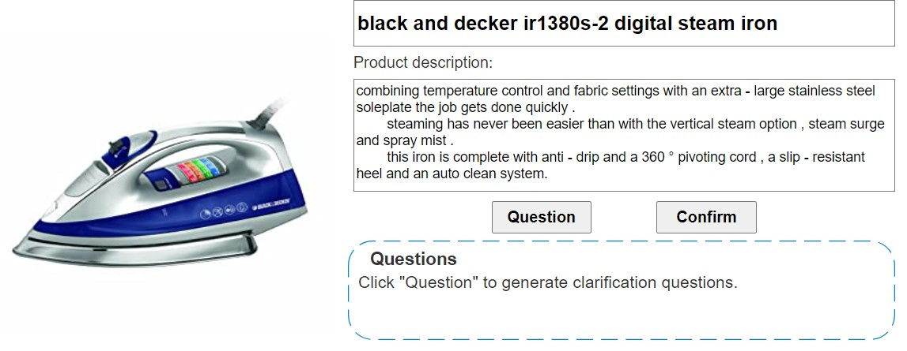
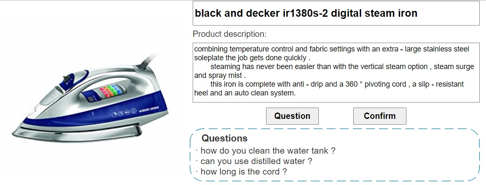

# KPCNet

Code for the WWW 2021 paper: [Diverse and Specific Clarification Question Generation with Keywords](./paper.pdf)

A Chinese blog with my reviews of clarification question generation, for readers interested in this topic. 

[阐明性问题生成(clarification question generation)概览](https://zhuanlan.zhihu.com/p/366598339)

The system requirements are:
- Linux OS
- Python 3

To run the code, first install the required python packages.

```
pip install -r requirements.txt
```

Then download corresponding resources [link](https://zenodo.org/record/4587504) to this directory and unzip it.

```
wget https://zenodo.org/record/4587504/files/KPCNet_resources.zip.001
wget https://zenodo.org/record/4587504/files/KPCNet_resources.zip.002
wget https://zenodo.org/record/4587504/files/KPCNet_resources.zip.003
wget https://zenodo.org/record/4587504/files/KPCNet_resources.zip.004

cat KPCNet_resources.zip.00* > KPCNet_resources.zip
unzip KPCNet_resources.zip
```

## Quick start: Web demo with pretrained model

Play with pretrained model in a flask-based web demo.

The required model and data directory has been specified in the default arguments (trained on Amazon Home & Kitchen dataset). You should be able to start it by:
```
python web_demo.py
```

The visit [127.0.0.1:10100](127.0.0.1:10100) if on a local environment, or `server_ip:10100` if you are running the code in a remote server. You should see something like this:



After click "Question" button, you can some CQs being generated like this:



Results may slightly differ as there are random factors in the model like the clustering step.

## 1st stage: train and evaluate the keyword predictor

### train the keyword predictor

```
export CUDA_VISIBLE_DEVICES=0
python -u main.py --train_context ./data/train_context.txt \
            --train_ques ./data/train_ques.txt \
            --train_ids ./data/train_asin.txt \
            --tune_context ./data/tune_context.txt \
            --tune_ques ./data/tune_ques.txt \
            --tune_ids ./data/tune_asin.txt \
            --test_context ./data/test_context.txt \
            --test_ques ./data/test_ques.txt \
            --test_ids ./data/test_asin.txt \
            --word_embeddings ./data/word_embeddings.p \
            --vocab ./data/vocab.p \
            --kwd_data_dir ./data \
            --kwd_vocab ./data/train_kwd_vocab.txt \
            --batch_size 256 \
            --patience 5 \
            --save_hparams_dir ./hparams \
            --n_epochs 100 \
            --seed 777 \
            --kwd_model_layer 1 \
            --kwd_predictor_type cnn \
            --save_dir ./ckpt \
            --no_neg_sample \
            --pretrain_kwd
```

### predict with the trained model

remember to replace ##YOUR_MODEL## with the produced filename.

```
export CUDA_VISIBLE_DEVICES=0
python -u predict.py --test_context ./data/test_context.txt \
                  --test_ques ./data/test_ques.txt \
                  --test_ids ./data/test_asin.txt \
                  --word_embeddings ./data/word_embeddings.p \
                  --vocab ./data/vocab.p \
                  --kwd_vocab ./data/train_kwd_vocab.txt \
                  --kwd_model_dir ./ckpt/##YOUR_MODEL##.kwd_pred \
                  --load_hparams_dir ./hparams/##YOUR_MODEL##.json \
                  --out_dir ./output \
                  --batch_size 128 \
                  --eval_kwd
```

### evaluate the keyword prediction

remember to replace ##YOUR_MODEL## with the produced filename.

```
python ./eval/kwd_eval_pre.py --truth ./data/test_ref.kwds \
                              --kwd ./output/##YOUR_MODEL##.kwd_pred.kwd_prob

python ./eval/kwd_eval_pre.py --truth ./data/test_ref.kwds \
                              --kwd ./output/kwd_D0.3_cnn_noneg.last.kwd_pred.kwd_prob
                              
```


## 2nd stage: train and evaluate the whole model pipeline

### train the pipeline

```
export CUDA_VISIBLE_DEVICES=0
python main.py --train_context ./data/train_context.txt \
            --train_ques ./data/train_ques.txt \
            --train_ids ./data/train_asin.txt \
            --tune_context ./data/tune_context.txt \
            --tune_ques ./data/tune_ques.txt \
            --tune_ids ./data/tune_asin.txt \
            --test_context ./data/test_context.txt \
            --test_ques ./data/test_ques.txt \
            --test_ids ./data/test_asin.txt \
            --save_dir ./ckpt \
            --word_embeddings ./data/word_embeddings.p \
            --vocab ./data/vocab.p \
            --kwd_data_dir ./data \
            --kwd_vocab ./data/train_kwd_vocab.txt \
            --batch_size 128 \
            --n_epochs 60 \
            --kwd_predictor_type cnn \
            --no_neg_sample \
            --freeze_kwd_model \
            --save_hparams_dir ./hparams \
            --kwd_model_dir ./ckpt/##YOUR_MODEL##.kwd_pred \
            --pretrain_ques
```

### predict with pipeline

remember to replace ##YOUR_MODEL## with the produced filename.

1. Threshold


```
export CUDA_VISIBLE_DEVICES=0
python predict.py	--test_context ./data/test_context.txt \
                  --test_ques ./data/test_ques.txt \
                  --test_ids ./data/test_asin.txt \
                  --word_embeddings ./data/word_embeddings.p \
                  --vocab ./data/vocab.p \
                  --kwd_vocab ./data/train_kwd_vocab.txt \
                  --load_models_dir ./ckpt/##YOUR_MODEL##.models \
                  --load_hparams_dir ./hparams/##YOUR_MODEL##.json \
                  --out_dir ./output \
                  --threshold 0.075 \
                  --save_all_beam \
                  --batch_size 128

```


Can further apply keyword filtering with `--load_filter_dir ./data/kwd_filter_dict.json`

2. CLUSTER

evaluate the pipeline

```
export CUDA_VISIBLE_DEVICES=0
python predict.py	--test_context ./data/test_context.txt \
                  --test_ques ./data/test_ques.txt \
                  --test_ids ./data/test_asin.txt \
                  --word_embeddings ./data/word_embeddings.p \
                  --vocab ./data/vocab.p \
                  --kwd_vocab ./data/train_kwd_vocab.txt \
                  --load_models_dir ./ckpt/##YOUR_MODEL##.models \
                  --load_hparams_dir ./hparams/##YOUR_MODEL##.json \
                  --out_dir ./output \
                  --load_kwd_edge_dir ./data/kwd_edges.npz \
                  --load_filter_dir ./data/kwd_filter_dict.json \
                  --save_all_beam \
                  --cluster_kwd \
                  --sample_top_k 6 \
                  --kwd_clusters 2 \
                  --sample_times 2 \
                  --batch_size 128
```

3. Threshold + Diverse beam search
```
python predict.py	--test_context ./data/test_context.txt \
                  --test_ques ./data/test_ques.txt \
                  --test_ids ./data/test_asin.txt \
                  --word_embeddings ./data/word_embeddings.p \
                  --vocab ./data/vocab.p \
                  --kwd_vocab ./data/train_kwd_vocab.txt \
                  --load_models_dir ./ckpt/##YOUR_MODEL##.models \
                  --load_hparams_dir ./hparams/##YOUR_MODEL##.json \
                  --load_filter_dir ./data/kwd_filter_dict.json \
                  --out_dir ./output \
                  --threshold 0.075 \
                  --batch_size 128 \
                  --diverse_beam \
                  --save_all_beam \
                  --beam_size 6 \
                  --diverse_group 3 \
                  --diverse_lambda 0.4 \
                  --batch_size 128
```

4. SAMPLE

```
python predict.py	--test_context ./data/test_context.txt \
                  --test_ques ./data/test_ques.txt \
                  --test_ids ./data/test_asin.txt \
                  --word_embeddings ./data/word_embeddings.p \
                  --vocab ./data/vocab.p \
                  --kwd_vocab ./data/train_kwd_vocab.txt \
                  --load_models_dir ./ckpt/##YOUR_MODEL##.models \
                  --load_hparams_dir ./hparams/##YOUR_MODEL##.json \
                  --out_dir ./output \
                  --save_all_beam \
                  --sample_top_k 6 \
                  --sample_top_p 0.9 \
                  --sample_times 2 \
                  --batch_size 128
```


### evaluate the generated sequence

remember to replace ##YOUR_OUTPUT##

1. BLEU, Distinct-3, response, P@5, length

```
sh eval_all.sh ##YOUR_OUTPUT##.beam0
```

2. METEOR

Need METEOR installed

```
METEOR=/home/xxx/meteor-1.5
java -Xmx2G -jar $METEOR/meteor-1.5.jar ./output/##YOUR_OUTPUT##.beam0_2 ./data/test_ref_combined \
										-l en -norm -r 10 \
```

3. Pairwise BLEU and Avg. BLEU

For threshold decoding (w/o diverse beam search)
```
python eval/pairwise_bleu.py --hyp_prefix ./output/##YOUR_MODEL##.beam \
                             --ref_prefix ./data/test_ref \
                             --deduplicate
```

For other selection methods, note to end with `a` with indicates the id of group
```
python eval/pairwise_bleu.py --hyp_prefix ./output/##YOUR_MODEL##.a \
                             --ref_prefix ./data/test_ref \
                             --deduplicate
```

### inference

The the example provided in the jupyter notebook `infer.ipynb`